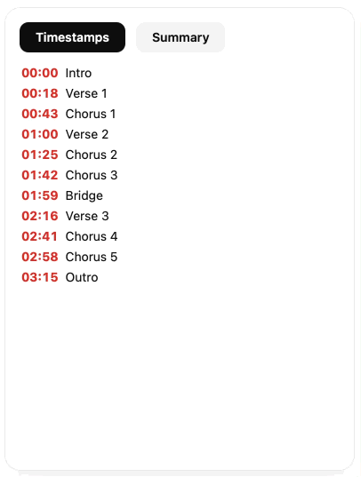
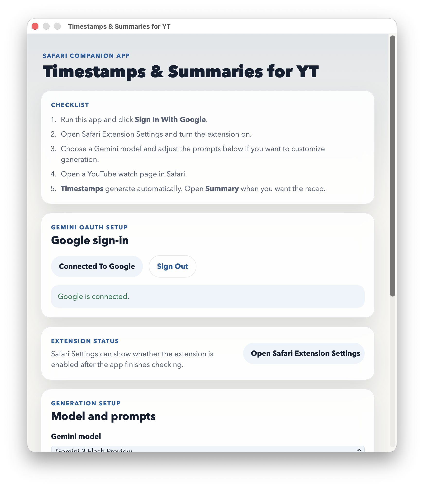
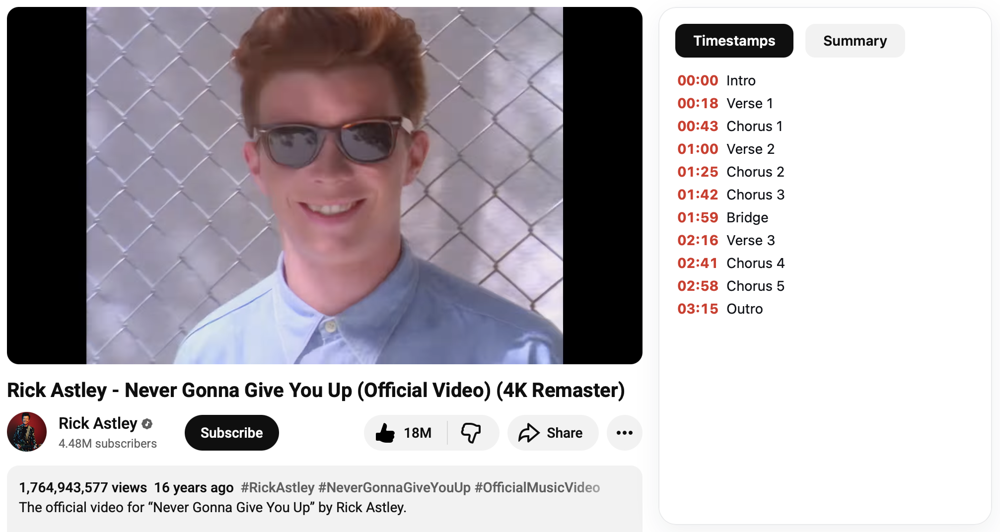

# YouTube Timestamps and Summaries

Safari extension and macOS companion app that generates YouTube timestamps from transcripts with ChatGPT and summaries with either ChatGPT or Apple Intelligence.

It adds a right-side sidebar to YouTube with:

- automatic video timestamps
- automatic video summaries

The extension reads the available YouTube transcript, sends it to the user's selected signed-in ChatGPT model for timestamps, and creates the summary with either that model or Apple Intelligence on the Mac. A ChatGPT account is required. No Google sign-in, API key, or developer backend is required.

Under the hood, the extension keeps transcript timing deterministic, validates generated timestamps against real transcript cue times, and keeps Apple Intelligence available as an optional local summary engine. See [ARCHITECTURE.md](ARCHITECTURE.md) for the current generation pipeline and guardrails.

## Preview

### Demo

### Companion App

### YouTube Sidebar

## Features

- right-side YouTube sidebar with `Timestamps` and `Summary`
- transcript-based generation for better timestamp accuracy
- configurable generation model, backed by the user's ChatGPT session
- summaries can use either the selected ChatGPT model or Apple Intelligence
- no Google OAuth setup, API keys, or developer backend

## Project Structure

- `YouTube Timestamps and Summaries/`
  macOS companion app
- `YouTube Timestamps and Summaries Extension/`
  Safari Web Extension and native bridge

## Extension Routing Notes

The Safari extension intentionally keeps the sidebar script scoped to supported YouTube video pages only:

- `content.js` should run on YouTube watch/live pages, where the timestamps and summary sidebar is mounted.
- `route-guard.js` can run on broader YouTube pages, but only to turn watch/live single-page navigations into full navigations so Safari injects `content.js`.
- Do not broaden `content.js` to all YouTube pages. Running the sidebar script on Shorts, feeds, subscriptions, or the homepage can disturb YouTube's own layout.

The `tests/js/manifest-routing.test.cjs` test protects this split.

## Setup

1. Use a Mac with macOS 26 or later.
2. In Xcode, set your Apple development team for both the app target and the extension target.
3. Run the macOS app.
4. Choose the generation model and summary engine in the app.
5. Sign in with ChatGPT from the app.
6. Click `Open Safari Extension Settings` and enable the Safari extension.
7. Open a YouTube watch page that has captions or a transcript.

## Releasing

For Developer ID signing, notarization, and release packaging, see [RELEASING.md](RELEASING.md).

For the transcript-analysis design, see [ARCHITECTURE.md](ARCHITECTURE.md).

## Limitations

- Requires macOS 26 or later.
- Timestamp generation requires the user to sign in with ChatGPT.
- Apple Intelligence summaries require Apple Intelligence to be available on the Mac. ChatGPT summaries do not.
- Videos without an available transcript cannot be summarized or timestamped.
- Active livestreams may not expose a stable transcript until the broadcast finishes.
- Generated timestamps and summaries can be incomplete or inaccurate.

## Troubleshooting

### Apple Intelligence is not available

- Confirm the Mac supports Apple Intelligence.
- Enable Apple Intelligence in macOS Settings.
- Wait for the on-device model to finish downloading if macOS says it is not ready yet.

### The Safari sidebar does not appear on YouTube

- Open the companion app and make sure the Safari extension is enabled.
- In Safari, verify the extension has access to YouTube.
- Refresh the YouTube watch page after enabling the extension.

### Timestamps or summary could not be generated

- Try the request again after refreshing the page.
- Confirm the video has captions or an available transcript.
- Confirm ChatGPT sign-in completed in the companion app.
- If the video is still live, wait until the stream finishes and YouTube exposes the transcript.

## Security Notes

- No Google OAuth client secret, Google API key, or developer-operated backend is required.
- ChatGPT sign-in tokens are stored locally in the app group container so the app and extension can use the user's own signed-in account.
- Transcript text is sent to ChatGPT for timestamp generation and, if selected, summary generation.
- When Apple Intelligence is selected for summaries, transcript text is processed locally by the app extension on the user's Mac.
- The WebExtension requests host access only for YouTube pages.

## GitHub Checklist

Before publishing:

- do not commit local build artifacts, logs, or screenshots that reveal private browsing context
- confirm no credentials or API keys are added before publishing
