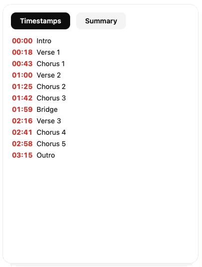
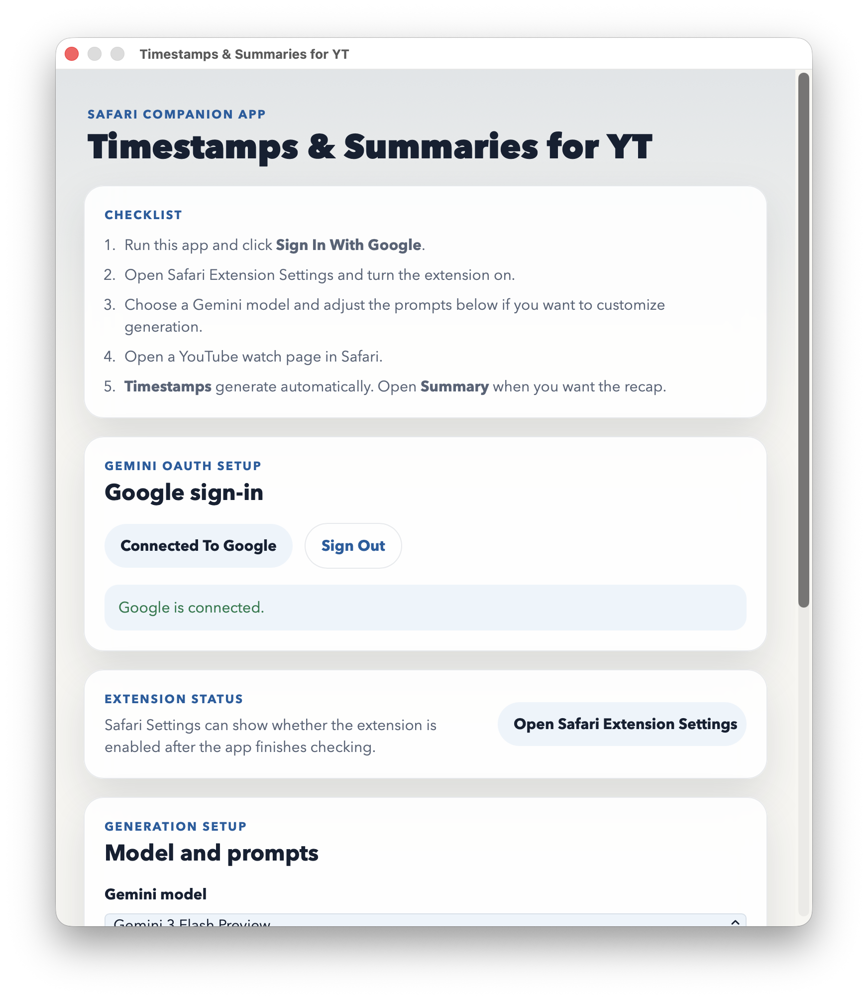
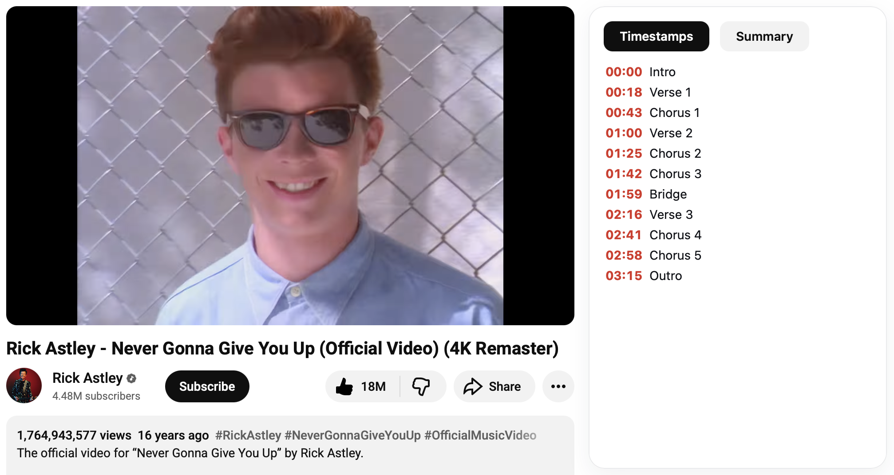

# Timestamps & Summaries for YT

Safari extension and macOS companion app that generates YouTube summaries with Apple Intelligence or a selected provider, and timestamps with ChatGPT/Codex or Grok.

It integrates with YouTube's native `In this video` panel when available, with a transcript-backed standalone sidebar fallback, and shows:

- automatic video chapters/timestamps when the selected provider is ready
- automatic video summaries

The extension reads the available YouTube transcript, creates summaries with Apple Intelligence on the Mac or the selected provider, and creates chapters/timestamps when the selected provider is ready. No API key or developer backend is required.

Under the hood, the extension keeps transcript timing deterministic, validates generated timestamps against real transcript cue times, and keeps Apple Intelligence available as an optional local summary engine. See [ARCHITECTURE.md](ARCHITECTURE.md) for the current generation pipeline and guardrails.

## Download

Download the signed and notarized macOS app:

[Download Timestamps & Summaries for YT](https://github.com/Hlbkomer/YouTube-Timestamps-and-Summaries/releases/latest/download/Timestamps-and-Summaries-for-YT.zip)

After unzipping, move the app to `Applications`, open it and enable the Safari extension.

## Preview

### Demo

### Companion App

### YouTube Integration

## Features

- YouTube-native `In this video` integration with a unified compact `Chapters` view and `Summary`, plus a standalone fallback when a transcript is available
- transcript-based generation for better timestamp accuracy
- native YouTube chapters and automatic Key moments are imported and shown in the same compact Chapters list as generated chapters
- companion-app defaults to prefer YouTube chapters or always generate, plus an inline Chapters-footer action to switch the current video when both sources are available
- all compact chapter lists can highlight the currently playing chapter
- configurable provider/model for timestamp generation and optional model summaries
- optional ChatGPT/Codex or Grok sign-in
- summaries can use Apple Intelligence without a provider, or the selected provider model when available
- result captions show the model/path used and the generation time, while extension tab labels stay stable
- no API key or developer backend

## Chapter Sources And YouTube Navigation

The companion app controls the default chapter policy: prefer chapters already available on YouTube, or always generate chapters from the transcript. YouTube creator chapters and automatic `Key moments` are imported into the same compact Chapters list as generated results. The small footer identifies the active source and, when another source is available, offers `Generate chapters from transcript`, `View generated chapters`, or `View YouTube chapters` without opening a separate menu.

Native chapters satisfy only the Chapters result. Summary remains independent and starts automatically whenever its configured engine and a transcript are available. While a newly selected video is still resolving a lazy YouTube Chapters/Key moments source, the panel shows `Checking for YouTube chapters...` instead of briefly rendering an empty result. If a page has neither YouTube's native `In this video` shell nor a usable transcript, the extension leaves that page untouched; a transcript-confirmed standalone sidebar remains available when only the native shell is missing.

The Safari toolbar popup now contains only a Settings shortcut. The former `Current video chapters` picker was removed because the watch-page content script already owns native-chapter discovery, cached generated results, the displayed source, and per-video overrides. Keeping the switch beside the result avoids duplicating that state across the page, background process, and popup.

YouTube navigation is handled as a transition rather than an immediate teardown. During watch-to-watch navigation, the outgoing panel chrome remains stable until YouTube commits the destination; the prior video's rows are then cleared before destination data is rendered. Generation work is bound to both its video and a monotonic request identity, so an older request cannot alter the destination video's result or remove the `Chapters...` busy label while its chapters are still generating. When leaving for the homepage or another non-video page, the integration is removed only after that navigation commits, avoiding a brief tab disappearance before the page changes. From feeds and the homepage, a small route guard converts watch/live transitions into real navigations so Safari reliably injects the video-page scripts. Shorts and other non-video pages never load the full integration.

## Project Structure

- macOS companion app target
- Safari Web Extension target and native bridge

## Extension Routing Notes

The Safari extension intentionally keeps the YouTube content script scoped to supported YouTube video pages only:

- `content.js` should run on YouTube watch/live pages, where the native-panel integration is mounted or a transcript-confirmed standalone fallback may be mounted.
- `content.js` keeps the outgoing panel stable during a navigation transition, gates observer/URL fallbacks until YouTube finishes, then resets or removes the integration for the committed destination.
- `route-guard.js` can run on broader YouTube pages, but only to turn watch/live single-page navigations into full navigations so Safari injects `content.js`; finish-event and URL-change fallbacks recover when YouTube bypasses the initial click interceptor.
- Do not broaden `content.js` to all YouTube pages. Running the full integration script on Shorts, feeds, subscriptions, or the homepage can disturb YouTube's own layout.

The `tests/js/manifest-routing.test.cjs` test protects this split.

## Setup

1. Use a Mac with macOS 26.4 or later.
2. In Xcode, set your Apple development team for both the app target and the extension target.
3. Run the macOS app.
4. Choose the generation model and summary engine in the app.
5. Optional: sign in with ChatGPT or Grok from the app for timestamps and model-powered summaries. A provider becomes selectable in Generation Setup after it is connected.
6. Click `Open Safari Extension Settings` and enable the Safari extension.
7. Open a supported YouTube watch page. Generated results require captions or a transcript; imported YouTube chapters do not.

## Releasing

For Developer ID signing, notarization, and release packaging, see [RELEASING.md](RELEASING.md). The current version 1.1 behavior audit and remaining release gates are recorded in [docs/release-1.1-readiness.md](docs/release-1.1-readiness.md).

## Optional Grok Login

Choose **Sign in with Grok** in the companion app to use a SuperGrok subscription. The app opens the xAI browser sign-in flow and uses the resulting OAuth session directly from the sandboxed app and Safari extension. No command-line client, Login Item, background helper, or developer backend is involved.

The app defaults Grok to **Grok 4.5** with explicit low reasoning for both Chapters and Summary, keeps **Grok 4.3** available with its provider-default reasoning as a fallback, and refreshes the connected account's text-capable Grok model catalog from xAI when possible. The hardened loopback listener has completed the normal Safari/xAI authorization flow on the Mac that previously reproduced the callback failure. If Safari still cannot open the temporary `127.0.0.1` callback page, copy the complete callback URL from Safari (or the one-time authorization code shown by xAI), paste it into the companion app's Grok sign-in panel, and choose **Complete Sign-In**. The manual path remains a recovery option; see [docs/grok-integration.md](docs/grok-integration.md).

ChatGPT/Codex defaults to **GPT-5.6 Terra**, begins with tested local choices, and can receive new `gpt-*` picker options from the repository's remote catalog without a binary update. Existing valid saved model selections are preserved on upgrade. The catalog maintenance and provider model policy are documented in [docs/model-catalog.md](docs/model-catalog.md).

## Apple Intelligence Summary By macOS Version

The visible `Summary` tab keeps one consistent workflow while choosing the local Apple Intelligence implementation for the installed macOS version:

- macOS 26 uses the established character-based summary path.
- macOS 27 uses a newer on-device, token-aware summary path and labels successful output accordingly.

This applies only when Apple Intelligence is selected for summaries. ChatGPT and Grok summaries continue to use the selected provider on every macOS version. Private Cloud Compute is not active while its managed Apple entitlement is pending. See [docs/macos27-summary.md](docs/macos27-summary.md) for the technical and testing notes.

For release notes, see [CHANGELOG.md](CHANGELOG.md).

For the transcript-analysis design, see [ARCHITECTURE.md](ARCHITECTURE.md). For the native YouTube panel implementation notes, see [docs/native-panel-integration.md](docs/native-panel-integration.md).

## Limitations

- Requires macOS 26.4 or later.
- Timestamp generation requires a ready selected provider.
- Grok generation requires a Grok account with the appropriate subscription and an active OAuth sign-in in the companion app.
- Apple Intelligence summaries require Apple Intelligence to be available on the Mac.
- Videos without an available transcript cannot be summarized or timestamped.
- Active livestreams may not expose a stable transcript until the broadcast finishes.
- Generated timestamps and summaries can be incomplete or inaccurate.

## Troubleshooting

### Apple Intelligence is not available

- Confirm the Mac supports Apple Intelligence.
- Enable Apple Intelligence in macOS Settings.
- Wait for the on-device model to finish downloading if macOS says it is not ready yet.

### The Safari panel does not appear on YouTube

- Open the companion app and make sure the Safari extension is enabled.
- In Safari, verify the extension has access to YouTube.
- Refresh the YouTube watch page after enabling the extension.

### Timestamps or summary could not be generated

- Try the request again after refreshing the page.
- Confirm the video has captions or an available transcript.
- For timestamps, confirm the selected provider is ready in the companion app.
- For summaries without a selected provider, confirm Apple Intelligence is available on the Mac.
- If the video is still live, wait until the stream finishes and YouTube exposes the transcript.

## Security Notes

- No API key or developer-operated backend is required.
- ChatGPT sign-in tokens are stored in the local macOS data-protection Keychain under a shared access group so the app and extension can use the user's own signed-in account without legacy login-Keychain authorization prompts.
- Grok OAuth tokens are stored in the same shared Keychain access group. The app does not use a command-line client or a separate helper.
- Transcript text is sent to the selected provider for timestamp generation and, if selected, summary generation.
- The companion app can fetch a small model catalog JSON file from this repository on GitHub to keep ChatGPT/Codex picker options current; this request does not include transcripts or sign-in tokens.
- When Apple Intelligence is selected for summaries, transcript text is processed locally by the app extension on the user's Mac.
- The WebExtension requests host access only for YouTube pages.

## GitHub Checklist

Before publishing:

- do not commit local build artifacts, logs, or screenshots that reveal private browsing context
- confirm no credentials or API keys are added before publishing
